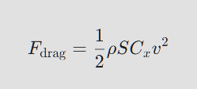
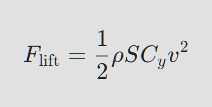
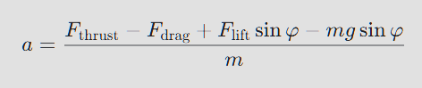

# Математическое моделирование взлёта самолёта
Проект посвящён исследованию влияния различных профилей крыла на время и дистанцию взлёта самолётов с 
разными типами двигателей. 

Моделирование выполнено на Python с использованием библиотек NumPy и Matplotlib.

# Описание проекта
В работе анализируются аэродинамические характеристики трёх моделей самолётов:

* Ил-96-300 с двигателем ПС-90А
* Ил-96-400М с двигателем ПД-35
* SJ-100 с двигателем ПД-8

Для каждой модели подбираются несколько профилей крыла (различной толщины и кривизны), рассчитываются параметры разбега 
и строятся графики зависимости дистанции от времени взлёта.

# Методология
Используются стандартные аэродинамические формулы:

* Сила сопротивления:
<div style="display: flex; justify-content: center;">
  
</div>
* Подъемная сила:
<div style="display: flex; justify-content: center;">
  
</div>
* Ускорение:
<div style="display: flex; justify-content: center;">
  
</div>

Моделирование выполняется численным интегрированием уравнений движения на этапе разбега до отрыва.

# Исследуемые комбинации
|Самолёт|Двигатель|Профили крыла|
|-------|---------|-------------|
|Ил-96-300|ПС-90А|ЦАГИ-6-16%, Р-П-14%, В-12%
|Ил-96-400М|ПД-35|Р-П-14%, ЦАГИ-6-19%, А-18%, В-16%
|SJ-100|ПД-8|А-18%, В-16%, Р-П-10%, ЦАГИ-6-12%

# Результаты
По итогам расчётов для каждой комбинации получены:

* Время взлёта (с)
* Дистанция взлёта (м)
* График зависимости дистанции от времени

Пример оптимальных результатов:

|Самолёт|Двигатель|Оптимальный профиль|Время (с)|Дистанция (м)|
|-------|---------|-------------------|---------|-------------|
|Ил-96-300|ПС-90А|Р-П-14%|61.02|2206.82|
|Ил-96-400М|ПД-35|Р-П-14%|59.33|2144.97|
|SJ-100|ПД-8|А-18%|40.56|1096.37|

# Запуск
Убедитесь, что установлены зависимости:

```bash
#!/bin/bash

pip install numpy matplotlib
```

Запустите каждый скрипт, чтобы рассчитать и построить график в нужной конфигурации:

```bash
#!/bin/bash

python graph_il-96-300.py
.....
```

# Структура директорий
* [Проектная работа]('./docs/model.pdf')
* [Презентация работы]('./docs/model.pptx')
* [Макет стенда для XXXII Всероссийских юношеских Чтений им. В.И.Вернадского]('./docs/stand.pptx')
* [Исходники расчётов графиков на Python](./src)

# Источники
Работа выполнена на основе открытых аэродинамических данных и справочных материалов по профилям крыльев и двигателям.

# Автор
Проект выполнен в рамках учебного исследования на физическом факультете МГУ Байковой Марией
Руководитель: доцент кафедры математики физического факультета МГУ, доктор физико-математических наук Михайлов Евгений Александрович
